# 手机乐园Pro - 手机乐园第三方客户端
采用单Activity多Fragment架构，支持全局滑动返回，实现手机乐园各种基本功能，支持登录、浏览、下载、发布动态等功能

## 下载体验APK
[app-debug.apk](/app-debug.apk)

## 截图预览

    
    
    
    
    
    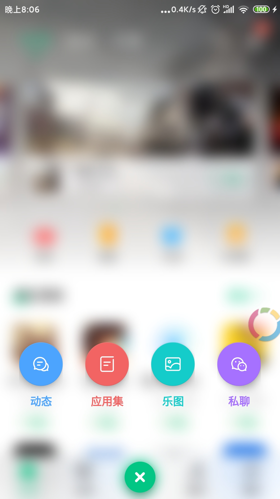
    
    
    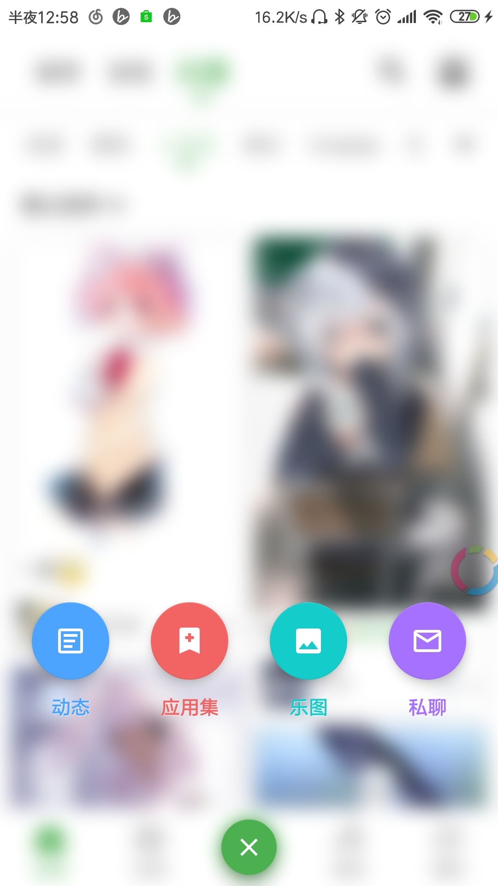
    
    
    
    
    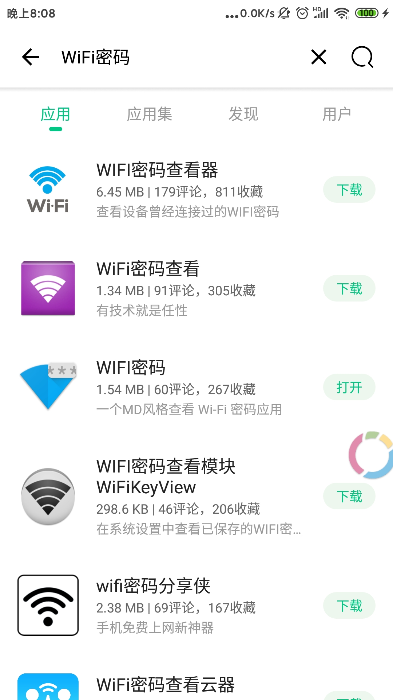
    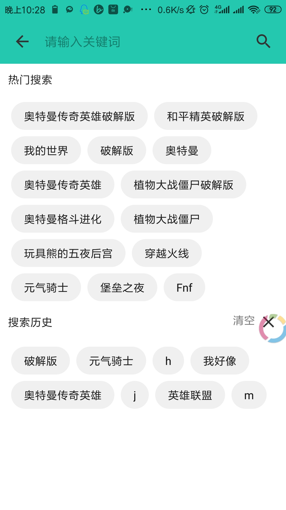
    
    
    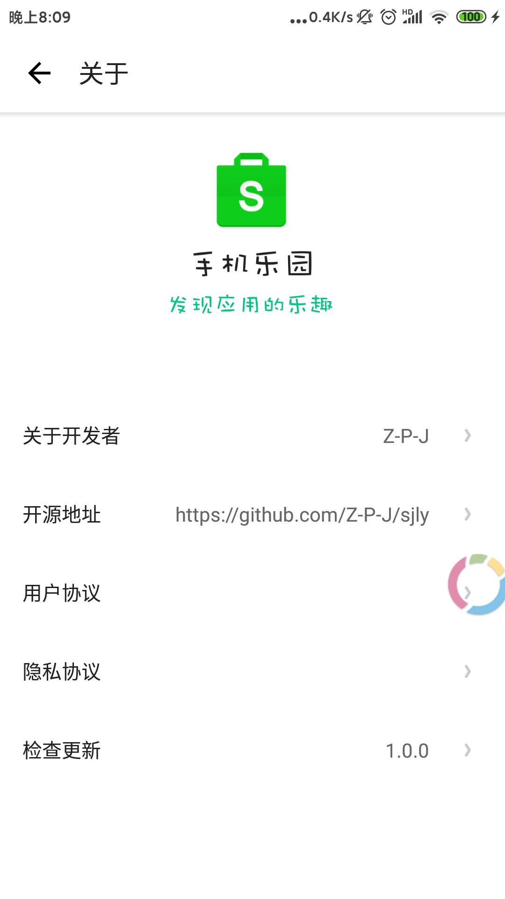
    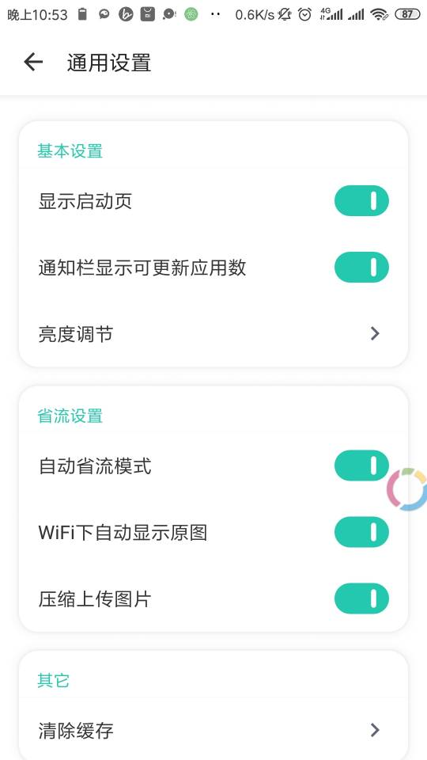
    
    
    
    
    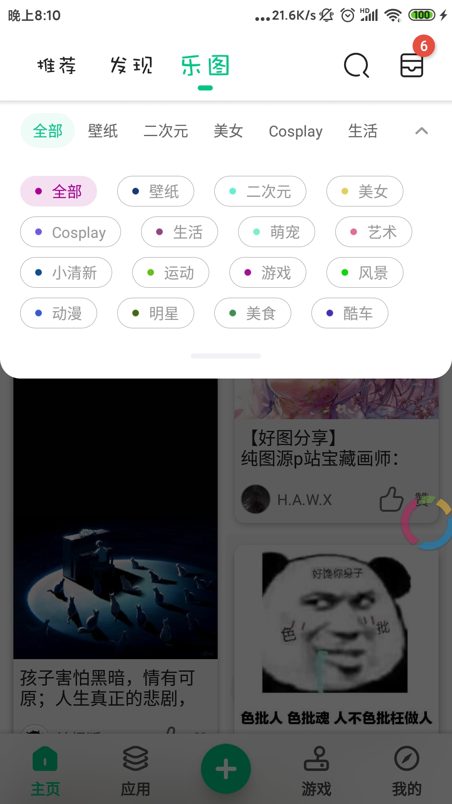
    
    
    
    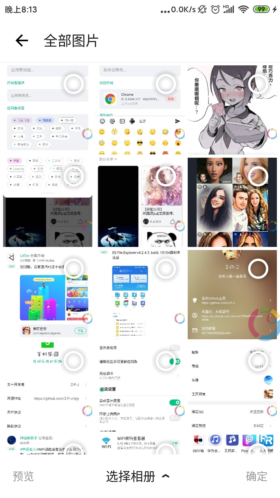
    
    
    
    
    
    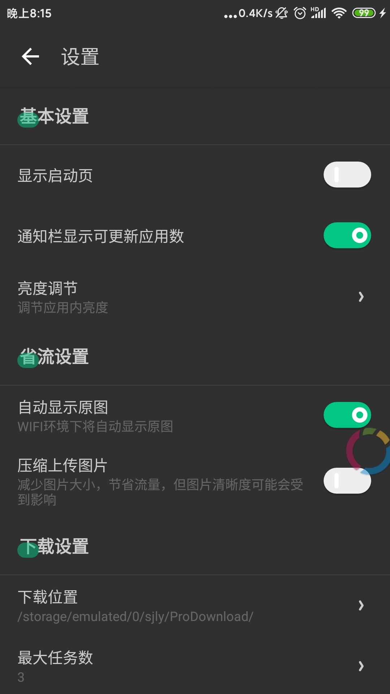
    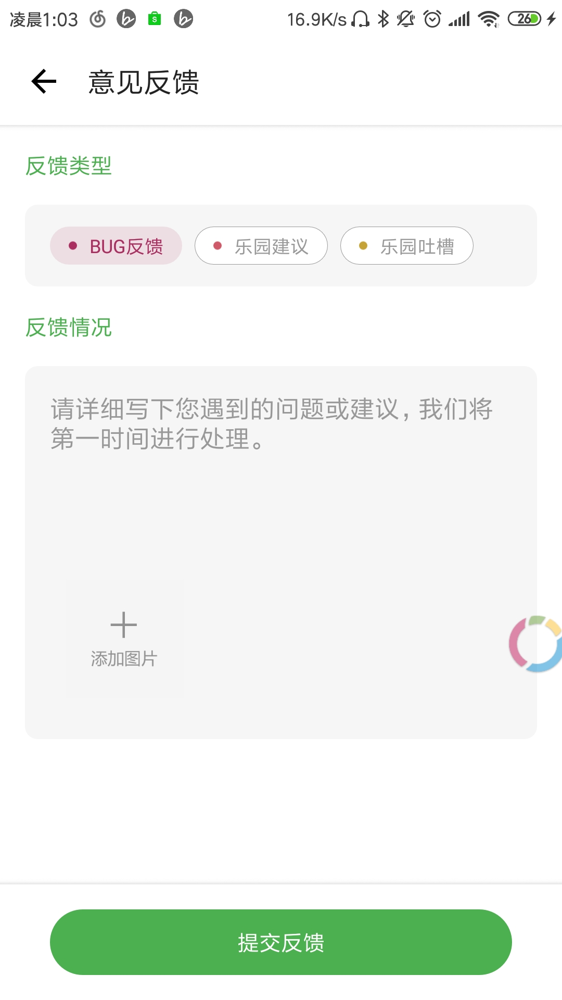
    
    
    
    
    
    
    
    
    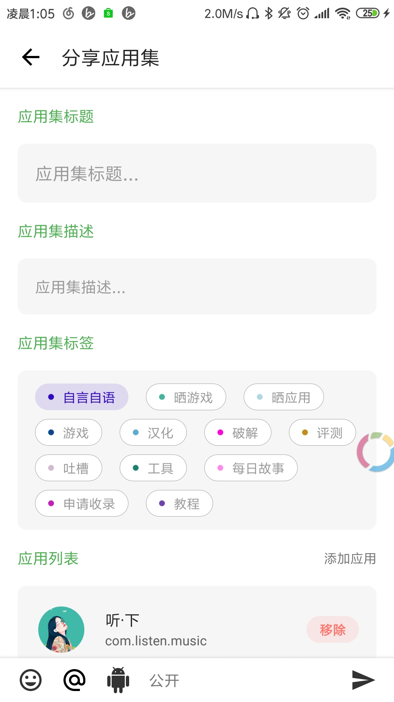
    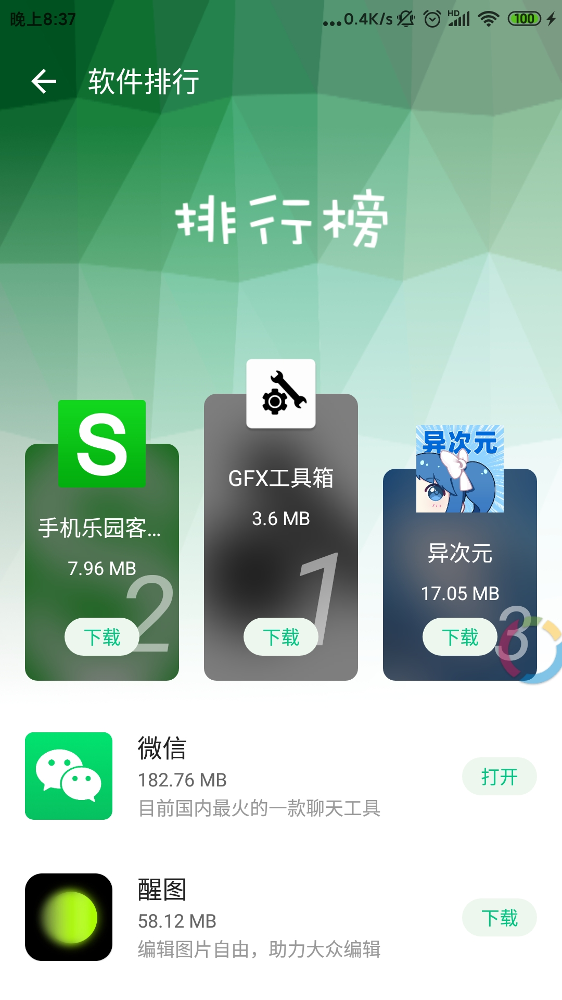
    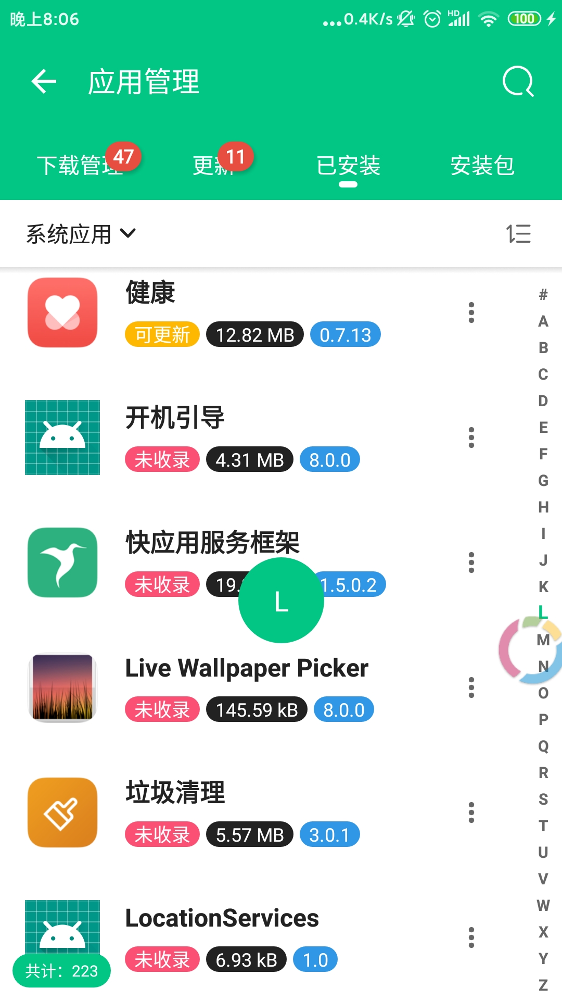
    
    
    
    
    
    
    
    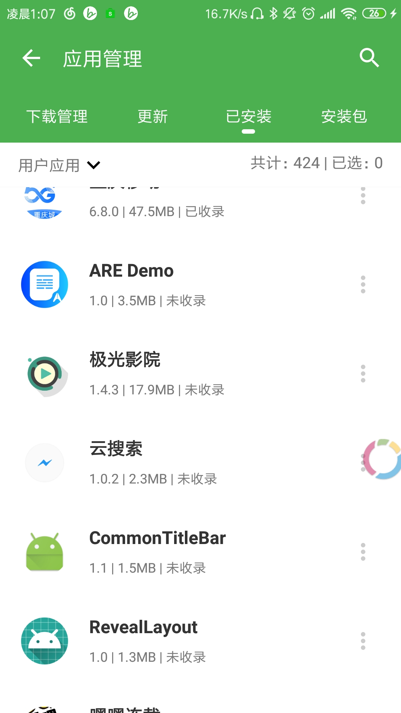
    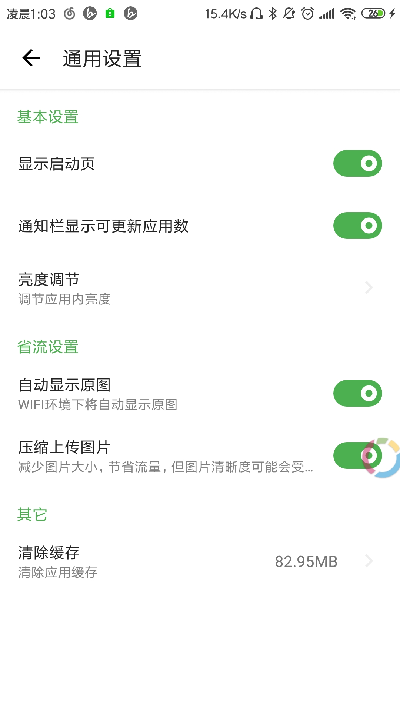
    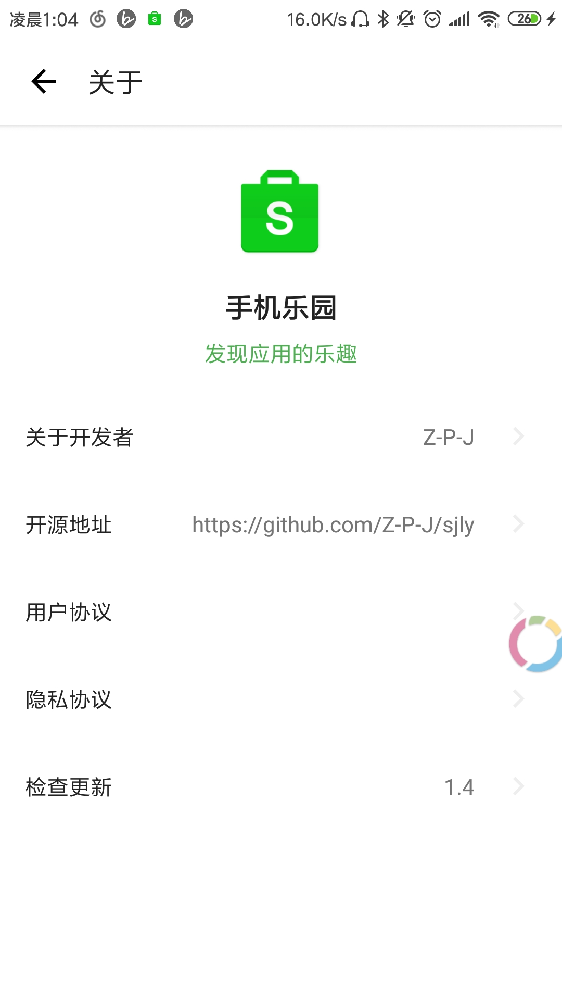
    
    
    

## 感谢以下开源库

- [Fragment框架Fragmentation](https://github.com/Z-P-J/Fragmentation)
- [强大的弹窗框架XPopup](https://github.com/li-xiaojun/XPopup)
- [HTML解析器Jsoup](https://github.com/jhy/jsoup)
- [图片加载框架Glide](https://github.com/bumptech/glide)
- [响应式编程框架RxJava](https://github.com/ReactiveX/RxJava)
- [RxJava for Android：RxAndroid](https://github.com/ReactiveX/RxAndroid)
- [数据库框架DBFlow](https://github.com/agrosner/DBFlow)
- [ViewPager指示器框架MagicIndicator](https://github.com/hackware1993/MagicIndicator)
- [知乎图片选择框架Matisse](https://github.com/zhihu/Matisse)
- [毛玻璃效果Blurred](https://github.com/goweii/Blurred)
- [轮播图Banner](https://github.com/AlpsDog/Banner)
- [权限申请XPermission](https://github.com/li-xiaojun/XPermission)
- [自定义SeekBar库IndicatorSeekBar](https://github.com/warkiz/IndicatorSeekBar)
- [等级评分控件CBRatingBar](https://github.com/CB-ysx/CBRatingBar)
- [可折叠面板控件ExpansionPanel](https://github.com/florent37/ExpansionPanel)
- [图片压缩CompressHelper](https://github.com/nanchen2251/CompressHelper)
- [九宫格图片NineGridView](https://github.com/Vanish136/NineGridView)
- [ExpandableTextView](https://github.com/MZCretin/ExpandableTextView)
- [聊天气泡控件BubbleView](https://github.com/houtrry/BubbleView)
- [BadgeView](https://github.com/qstumn/BadgeView)

## 其他

- [基于Fragmentation的Fragment框架ZFragmentation](https://github.com/Z-P-J/sjly/tree/master/fragmentation)
- [基于XPopup和ZFragmentation弹窗框架Fragmentation-Dialog](https://github.com/Z-P-J/sjly/tree/master/fragmentation-dialog)
- [网络请求库ZHttp，内置Jsoup](https://github.com/Z-P-J/ZHttp)
- [文件下载框架ZDownloader](https://github.com/Z-P-J/ZDownloader)
- [RecyclerView框架ZRecyclerView](https://github.com/Z-P-J/ZRecyclerView)
- [RxBus](https://github.com/Z-P-J/RxBus)
- [RxLife](https://github.com/Z-P-J/RxLife)
- [ZToolBar](https://github.com/Z-P-J/ZToolBar)
- [ZSwitcher](https://github.com/Z-P-J/ZSwitcher)
- [SmoothCheckBox](https://github.com/Z-P-J/SmoothCheckBox)
- [StateManager](https://github.com/Z-P-J/StateManager)
- [ZToast](https://github.com/Z-P-J/ZToast)